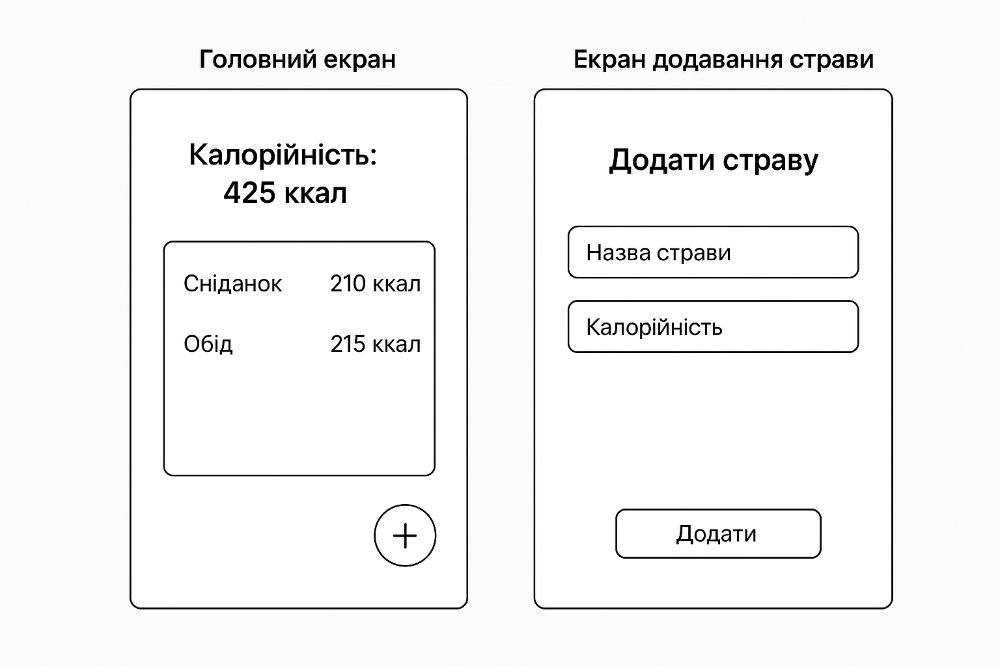

# Лабораторна робота №3  
**Тема:** Software Development Life Cycle (SDLC) — Життєвий цикл програмного забезпечення  

---

## 1. Планування  
Мета: створити простий застосунок **"Калькулятор калорій"**, який дозволяє користувачу додавати страви та підраховувати їх загальну калорійність за день.  

Користувач повинен мати можливість:  
- вводити страви з кількістю калорій;  
- бачити підсумкову кількість калорій за день;  
- контролювати свій щоденний раціон.  

---

## 2. Аналіз вимог (User Stories)  

1. Як користувач, я хочу додавати страву з калорійністю, щоб відстежувати свій раціон. ✅ (Must have)  
2. Як користувач, я хочу бачити загальну кількість калорій за день, щоб контролювати норму. ✅ (Must have)  
3. Як користувач, я хочу видаляти страви зі списку, щоб виправляти помилки.  
4. Як користувач, я хочу мати список усіх введених страв із калоріями, щоб бачити деталізацію.  
5. Як користувач, я хочу редагувати калорійність страви, щоб виправляти неточності.  

---

## 3. Дизайн (Прототип)  

**Головний екран:**  
- Загальна кількість калорій за день  
- Список страв із калоріями  
- Кнопка `+` для додавання страви  

**Екран додавання страви:**  
- Поле для назви страви  
- Поле для калорійності  
- Кнопка "Додати"  

### Прототип:  
  

---

# 5. Тестування
addMeal("Яблуко", 95)           # Очікувано: додається, totalCalories += 95
addMeal("", 0)                   # Очікувано: Error: Invalid input
removeMeal("Яблуко")             # Очікувано: видаляється, totalCalories -= 95
addMeal("Яблуко", 95)            # Очікувано: додається
addMeal("Хліб", 150)             # Очікувано: додається, totalCalories = 245
removeMeal("Піца")               # Очікувано: Error: Meal not found

---

# 6. Висновки
# Для цього проєкту найбільше підходить Agile-підхід із короткими ітераціями.
# Це дозволяє поступово розширювати функціонал (щоденний ліміт, графіки, статистика) і швидко реагувати на фідбек користувачів.
# Модель Waterfall була б надто жорсткою для такого простого додатку, а Spiral — занадто складною.

---

## 4. Реалізація (Псевдокод)

```pseudo
# Список страв та загальні калорії
mealList = []
totalCalories = 0

# Додати страву
function addMeal(mealName, calories):
    if mealName is empty OR calories <= 0:
        return "Error: Invalid input"
    else:
        meal = createMeal(mealName, calories)
        mealList.add(meal)
        totalCalories = totalCalories + calories
        return "Meal added"

# Показати загальні калорії
function getTotalCalories():
    return totalCalories

# Видалити страву
function removeMeal(mealName):
    find meal in mealList
    if meal exists:
        totalCalories = totalCalories - meal.calories
        mealList.remove(meal)
        return "Meal removed"
    else:
        return "Error: Meal not found"

# 5. Тестування
addMeal("Яблуко", 95)           # Очікувано: додається, totalCalories += 95
addMeal("", 0)                   # Очікувано: Error: Invalid input
removeMeal("Яблуко")             # Очікувано: видаляється, totalCalories -= 95
addMeal("Яблуко", 95)            # Очікувано: додається
addMeal("Хліб", 150)             # Очікувано: додається, totalCalories = 245
removeMeal("Піца")               # Очікувано: Error: Meal not found

# 6. Висновки
# Для цього проєкту найбільше підходить Agile-підхід із короткими ітераціями.
# Це дозволяє поступово розширювати функціонал (щоденний ліміт, графіки, статистика) і швидко реагувати на фідбек користувачів.
# Модель Waterfall була б надто жорсткою для такого простого додатку, а Spiral — занадто складною.
